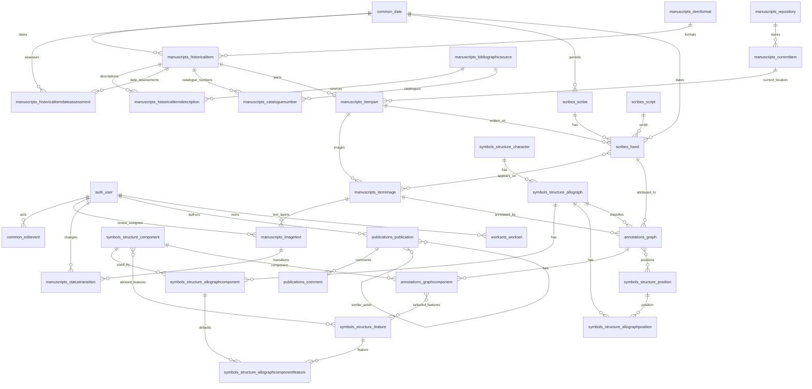

# Database Map

This maps the current backend schema from the live Docker Compose PostgreSQL
database `test_db`, cross-checked against the Django models and migrations.

Snapshot details:

- Verified against `test_db` on 2026-05-29.
- PostgreSQL is running from the Compose `postgres` service.
- `test_db` has 52 public tables.
- Other local databases present at inspection time: `local`, `old_arch`,
  `postgres`, `test_db`.

## Practical Overview

The domain data hangs off seven main areas:

- `manuscripts`: physical/current items, historical items, item parts, images,
  transcriptions/translations, catalogue references.
- `scribes`: scribes, scripts, hands, and the item images a hand appears on.
- `symbols_structure`: reusable palaeographic structure: characters,
  allographs, components, features, and positions.
- `annotations`: graph annotations on item images, linking image regions to
  hands, allographs, components, features, and positions.
- `publications`: public CMS content, comments, carousel items, events, tags.
- `worksets`: user-saved/citable lightbox collections.
- `common`: shared date vocabulary and append-only edit events.

`apps.search`, `apps.annotations_w3c`, and `apps.iiif_presentation` do not
define relational database models; they build service/API representations from
the domain models.

## Live Row Counts

These are exact counts from `test_db` at inspection time.

| Table | Rows |
| --- | ---: |
| `annotations_graph` | 24586 |
| `annotations_graph_positions` | 1485 |
| `annotations_graphcomponent` | 3027 |
| `annotations_graphcomponent_features` | 3303 |
| `auth_group` | 2 |
| `auth_group_permissions` | 0 |
| `auth_permission` | 172 |
| `auth_user` | 14 |
| `auth_user_groups` | 0 |
| `auth_user_user_permissions` | 0 |
| `authtoken_token` | 1 |
| `common_date` | 610 |
| `common_editevent` | 22 |
| `django_admin_log` | 0 |
| `django_content_type` | 43 |
| `django_migrations` | 82 |
| `django_session` | 5 |
| `manuscripts_bibliographicsource` | 40 |
| `manuscripts_cataloguenumber` | 1414 |
| `manuscripts_currentitem` | 718 |
| `manuscripts_historicalitem` | 713 |
| `manuscripts_historicalitemdateassessment` | 22 |
| `manuscripts_historicalitemdescription` | 703 |
| `manuscripts_imagetext` | 899 |
| `manuscripts_itemformat` | 20 |
| `manuscripts_itemimage` | 3277 |
| `manuscripts_itemimage_tags` | 0 |
| `manuscripts_itempart` | 713 |
| `manuscripts_repository` | 9 |
| `manuscripts_statustransition` | 0 |
| `manuscripts_tagulous_itemimage_tags` | 0 |
| `publications_carouselitem` | 8 |
| `publications_comment` | 0 |
| `publications_event` | 0 |
| `publications_publication` | 61 |
| `publications_publication_keywords` | 67 |
| `publications_publication_similar_posts` | 0 |
| `publications_tagulous_publication_keywords` | 3 |
| `scribes_hand` | 696 |
| `scribes_hand_item_part_images` | 715 |
| `scribes_scribe` | 3 |
| `scribes_script` | 0 |
| `symbols_structure_allograph` | 103 |
| `symbols_structure_allographcomponent` | 80 |
| `symbols_structure_allographcomponentfeature` | 68 |
| `symbols_structure_allographposition` | 337 |
| `symbols_structure_character` | 103 |
| `symbols_structure_component` | 15 |
| `symbols_structure_component_features` | 76 |
| `symbols_structure_feature` | 54 |
| `symbols_structure_position` | 17 |
| `worksets_workset` | 0 |

## ER Map



## Table Groups

### Common

| Table | Purpose | Important fields |
| --- | --- | --- |
| `common_date` | Sortable display date/range. | `date`, `min_weight`, `max_weight` |
| `common_editevent` | Append-only editorial audit log. | `actor_id`, `action`, `target_type`, `target_id`, `summary`, `payload`, `created` |

### Manuscripts

| Table | Purpose | Important fields / links |
| --- | --- | --- |
| `manuscripts_itemformat` | Controlled item format list. | `name` |
| `manuscripts_repository` | Repository/library/person/online source. | `name`, `label`, `place`, `url`, `type` |
| `manuscripts_bibliographicsource` | Catalogue/manuscript-description source. | `name`, `label` |
| `manuscripts_currentitem` | Current physical holding. | `repository_id`, `shelfmark`, `description` |
| `manuscripts_historicalitem` | Historical document/item. | `type`, `format_id`, `language`, `hair_type`, `date_id` |
| `manuscripts_historicalitemdateassessment` | Current per-item date assessment metadata. | `historical_item_id`, `date_id`, `probable_text_date`, `dating_notes` |
| `manuscripts_historicalitemdescription` | Source-backed description of a historical item. | `historical_item_id`, `source_id`, `content` |
| `manuscripts_itempart` | Part of a historical item, optionally located in a current item. | `historical_item_id`, `current_item_id`, `current_item_locus`, `custom_label` |
| `manuscripts_cataloguenumber` | Catalogue identifier for a historical item. | `historical_item_id`, `catalogue_id`, `number`, `url` |
| `manuscripts_itemimage` | IIIF-backed image for an item part. | `item_part_id`, `image`, `locus`, `tags` |
| `manuscripts_imagetext` | Transcription/translation layer for an image. | `item_image_id`, `content`, `content_dpt_legacy`, `type`, `status`, `review_assignee_id`, `language`, `created`, `modified` |
| `manuscripts_statustransition` | Review workflow status-change log for image text. | `image_text_id`, `actor_id`, `from_status`, `to_status`, `note`, `created` |
| `manuscripts_tagulous_itemimage_tags` | Tagulous tag vocabulary for image tags. | `name`, `slug`, `count`, `protected` |
| `manuscripts_itemimage_tags` | Implicit tag join table. | `itemimage_id`, `tagulous_itemimage_tags_id` |

### Scribes

| Table | Purpose | Important fields / links |
| --- | --- | --- |
| `scribes_scribe` | Named scribe. | `name`, `period_id`, `scriptorium` |
| `scribes_script` | Script classification. | `name` |
| `scribes_hand` | Hand used on an item part. | `scribe_id`, `item_part_id`, `script_id`, `name`, `num`, `priority`, `is_default`, `date_id`, `place`, `description` |
| `scribes_hand_item_part_images` | Images associated with a hand. | `hand_id`, `itemimage_id` |

### Symbols Structure

| Table | Purpose | Important fields / links |
| --- | --- | --- |
| `symbols_structure_character` | Character, letter, numeral, punctuation, etc. | `name`, `type` |
| `symbols_structure_allograph` | Allograph belonging to a character. | `character_id`, `name` |
| `symbols_structure_feature` | Reusable feature name. | `name` unique |
| `symbols_structure_component` | Reusable component name. | `name` unique |
| `symbols_structure_component_features` | Features allowed on a component. | `component_id`, `feature_id` |
| `symbols_structure_allographcomponent` | Component configured for an allograph. | `allograph_id`, `component_id` |
| `symbols_structure_allographcomponentfeature` | Feature configured for an allograph component. | `allograph_component_id`, `feature_id`, `set_by_default` |
| `symbols_structure_position` | Position vocabulary. | `name` unique |
| `symbols_structure_allographposition` | Position configured for an allograph. | `allograph_id`, `position_id` |

### Annotations

| Table | Purpose | Important fields / links |
| --- | --- | --- |
| `annotations_graph` | Annotation/region on an item image. | `item_image_id`, `annotation`, `annotation_type`, `allograph_id`, `hand_id`, `note`, `internal_note`, `created` |
| `annotations_graphcomponent` | Component selected on a graph. | `graph_id`, `component_id` |
| `annotations_graphcomponent_features` | Features selected for a graph component. | `graphcomponent_id`, `feature_id` |
| `annotations_graph_positions` | Positions selected for a graph. | `graph_id`, `position_id` |

### Publications

| Table | Purpose | Important fields / links |
| --- | --- | --- |
| `publications_carouselitem` | Homepage/public carousel item. | `ordering`, `image`, `title`, `url` |
| `publications_event` | Event content page. | `title`, `slug`, `content`, `created_at`, `updated_at` |
| `publications_publication` | Article/blog/news publication. | `author_id`, `title`, `slug`, `content`, `preview`, `status`, booleans, `published_at`, timestamps |
| `publications_comment` | Comment on a publication. | `post_id`, `content`, author fields, `is_approved`, timestamps |
| `publications_publication_similar_posts` | Self many-to-many related posts. | `from_publication_id`, `to_publication_id` |
| `publications_tagulous_publication_keywords` | Tagulous vocabulary for publication keywords. | `name`, `slug`, `count`, `protected` |
| `publications_publication_keywords` | Implicit keyword join table. | `publication_id`, `tagulous_publication_keywords_id` |

### Worksets

| Table | Purpose | Important fields / links |
| --- | --- | --- |
| `worksets_workset` | User-saved lightbox collection with a stable citable id. | `owner_id`, `public_id`, `title`, `description`, `visibility`, `payload`, `created_at`, `updated_at` |

### Auth And Framework Tables

Expect standard Django/DRF tables alongside the project tables:

- `auth_user`, `auth_group`, `auth_permission`, and auth join tables.
- `django_admin_log`, `django_content_type`, `django_migrations`,
  `django_session`.
- `authtoken_token`.

The `apps.users` app currently has a data migration that creates local
superusers; it does not define a custom user table.

## Important Constraints

| Constraint | Meaning |
| --- | --- |
| `unique_allograph_component` | One component per allograph in `symbols_structure_allographcomponent`. |
| `unique_allograph_component_feature` | One feature per allograph component in `symbols_structure_allographcomponentfeature`. |
| `unique_allograph_position` | One position per allograph in `symbols_structure_allographposition`. |
| `unique_graph_component` | One component per graph in `annotations_graphcomponent`. |
| `imagetext_one_per_kind_per_image` | One `Transcription` and one `Translation` per image. |
| `historical_item_date_assessment_unique` | One date assessment per historical item/date pair. |
| `graph_editorial_or_required_allograph_hand` | `editorial` and `text` graphs may omit `allograph`/`hand`; image glyph graphs require both. |
| `worksets_workset_public_id_key` | Workset citable UUIDs are unique. |

## Recheck `test_db`

Use these from the backend directory.
`config/test.env` currently points `DATABASE_URL` at `local`, so use the
explicit `test_db` database name in the commands below.

```bash
# Confirm test_db exists.
docker compose exec -T postgres psql -U postgres -d postgres -P pager=off \
  -c "SELECT datname FROM pg_database WHERE datname = 'test_db';"

# List public tables in test_db.
docker compose exec -T postgres psql -U postgres -d test_db -P pager=off \
  -c "\\dt public.*"

# List foreign keys in test_db.
docker compose exec -T postgres psql -U postgres -d test_db -P pager=off \
  -c "SELECT tc.table_name, kcu.column_name, ccu.table_name AS foreign_table_name, ccu.column_name AS foreign_column_name FROM information_schema.table_constraints tc JOIN information_schema.key_column_usage kcu ON tc.constraint_name = kcu.constraint_name AND tc.table_schema = kcu.table_schema JOIN information_schema.constraint_column_usage ccu ON ccu.constraint_name = tc.constraint_name AND ccu.table_schema = tc.table_schema WHERE tc.constraint_type = 'FOREIGN KEY' AND tc.table_schema = 'public' ORDER BY tc.table_name, kcu.column_name;"

# Count rows for all public tables in test_db.
docker compose exec -T postgres psql -U postgres -d test_db -P pager=off \
  -c "SELECT table_name, (xpath('/row/c/text()', query_to_xml(format('SELECT count(*) AS c FROM %I.%I', table_schema, table_name), false, true, '')))[1]::text AS rows FROM information_schema.tables WHERE table_schema = 'public' AND table_type = 'BASE TABLE' ORDER BY table_name;"
```

To point Django management commands at `test_db`, run them through Compose.
The default API environment currently points `DATABASE_URL` at `test_db`; if
your local `.env` differs, set `DATABASE_URL` or `TARGET_DATABASE_URL` for the
command instead of editing checked-in files.

```bash
docker compose run --rm api python manage.py showmigrations
```
